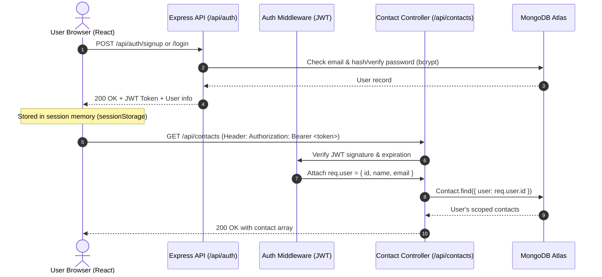

# ContactHub — Full-Stack Contact Management Application - ASSIGNMENT

A full-stack, responsive Contact Management web application featuring **React.js**, **Tailwind CSS (v3)** with a **Claude-inspired light beige & terracotta aesthetic**, **Poppins typography**, **JWT-based user authentication**, **protected REST API endpoints**, **MongoDB & Mongoose object modeling**, and **strict Zod schema validation**.

Built as a technical assignment meeting all specified requirements with 100% data persistence in MongoDB.

Deployed application link : https://contact-management-system-assignment.onrender.com/
---

## 🌟 Key Features

- 🔐 **User Authentication & Authorization**:
  - Secure User Registration (Sign Up) and Login with `bcryptjs` password hashing (salt rounds: 10).
  - Stateless JSON Web Token (**JWT**) authentication with 7-day token validity.
  - **Protected Routes**: All contact endpoints (`/api/contacts/*`) require a valid Bearer token.
  - **User Data Isolation**: Each authenticated user has their own private contacts directory.
- 📇 **Full Contact CRUD**:
  - **Add Contact**: Create new contacts with Full Name, Email Address, and Phone Number.
  - **Display Contacts**: Responsive card grid with dynamically generated initial avatars and clean contact chips.
  - **Edit Contact**: Update existing contact details with pre-filled form and live validation.
  - **Delete Contact**: Safe deletion with custom confirmation modal dialog.
- 🔍 **Real-Time Instant Search**:
  - Filter contacts dynamically by name, email, or phone with instant debounced feedback.
  - Keyboard shortcut: Press `/` anywhere to focus the search bar instantly.
- 🛡️ **Comprehensive Validation**:
  - **Client-Side**: Real-time inline field validation (name length, RFC 5322 email regex, phone digit length).
  - **Server-Side**: Strict Express middleware powered by **Zod schemas** returning structured `400 Bad Request` validation error arrays.
- 🎨 **Claude-Inspired Aesthetic & Modern Typography**:
  - Warm light beige palette (`#FAF8F5` canvas, `#F5F2EB` subtle borders and cards, `#D97757` terracotta accents).
  - Clean modern typography using **Poppins** Google Font.
  - 1-Click Copy button for emails and phone numbers with instant toast alerts.
  - 100% mobile-friendly responsive layout for phones, tablets, and desktops.
- 🧪 **Sample Demo Data Loader**:
  - "Load Sample Contacts" button to quickly populate the authenticated user's MongoDB account with sample contacts for demonstration and testing.

---

## 🛠️ Technology Stack

| Layer | Technologies |
| :--- | :--- |
| **Frontend** | React 18, Tailwind CSS v3, Lucide React Icons, Vite 6, Poppins Font |
| **Backend** | Node.js, Express.js 4, MongoDB, Mongoose 8, Zod (`zod`), JWT (`jsonwebtoken`), `bcryptjs`, CORS, Dotenv |
| **Database** | MongoDB (MongoDB Atlas Cloud Cluster or Local MongoDB Community Server) |
| **Design System** | Claude-inspired warm light beige (`#FAF8F5`), terracotta (`#D97757`), charcoal typography |

---

## 📂 Project Structure

```
Contact-management-Application-Assignment/
├── backend/
│   ├── db/
│   │   ├── connection.js          # MongoDB connection handler with Mongoose
│   │   ├── User.js                # Mongoose User model with bcrypt pre-save hashing
│   │   └── Contact.js             # Mongoose Contact model scoped to user ObjectId
│   ├── middleware/
│   │   ├── auth.js                # JWT verification middleware (Authorization: Bearer)
│   │   └── validate.js            # Zod validation schemas & request validator middleware
│   ├── service/
│   │   ├── authService.js         # Authentication business logic (signup, login, profile)
│   │   └── contactService.js      # Contact business logic (CRUD, search, demo reset)
│   ├── routes/
│   │   ├── authRoutes.js          # /api/auth routes (signup, login, me)
│   │   └── contactRoutes.js       # /api/contacts routes (protected CRUD)
│   ├── data/
│   │   └── sampleContacts.json    # Initial sample contact data template
│   ├── .env                       # Environment variables (PORT, MONGODB_URI, JWT_SECRET)
│   ├── .env.example               # Environment variables template
│   ├── package.json               # Backend dependencies and scripts
│   └── server.js                  # Express entry point, API router & static client server
├── frontend/
│   ├── src/
│   │   ├── api/
│   │   │   └── client.js          # Centralized Fetch API client with auto JWT injection
│   │   ├── components/
│   │   │   ├── Navbar.jsx         # Responsive top navbar with user profile & actions
│   │   │   ├── GuestHero.jsx      # Warm welcome hero card for unauthenticated visitors
│   │   │   ├── ContactCard.jsx    # Individual contact card with avatar, copy buttons & actions
│   │   │   ├── ContactModal.jsx   # Add/Edit contact modal with inline Zod-matching validation
│   │   │   ├── DeleteModal.jsx    # Delete confirmation dialog
│   │   │   ├── AuthModal.jsx      # Sign In / Sign Up tabbed authentication dialog
│   │   │   └── Toast.jsx          # Notification toast component
│   │   ├── App.jsx                # Main application state, search, sort, and modal orchestration
│   │   ├── index.css              # Tailwind CSS directives & custom styling
│   │   └── main.jsx               # React DOM entry point
│   ├── index.html                 # HTML template with Google Fonts (Poppins)
│   ├── tailwind.config.js         # Tailwind v3 config with Claude beige palette & Poppins
│   ├── postcss.config.js          # PostCSS configuration for Tailwind
│   ├── vite.config.js             # Vite config with React plugin and /api backend proxy
│   └── package.json               # Frontend dependencies and build scripts
├── .gitignore                     # Git ignore rules for node_modules, .env, and dist
├── package.json                   # Root orchestrator scripts (build, dev, install)
└── README.md                      # Complete assignment documentation
```

---

## 🚀 Setup & Execution Guide

### Prerequisites

Ensure you have the following installed:
1. **Node.js** (v18.0.0 or later): Check with `node -v`
2. **npm** (v9.0.0 or later): Check with `npm -v`
3. **MongoDB Connection**:
   - A free **MongoDB Atlas** cluster connection string (e.g. `mongodb+srv://...`), OR
   - A local **MongoDB Community Server** running on `mongodb://127.0.0.1:27017`

---

### Step 1: Clone & Install Dependencies

Clone your repository and install dependencies from the root directory:

```bash
git clone <your-repository-url>
cd Contact-management-Application-Assignment

# Install all backend and frontend dependencies in one command
npm run install:all
```

*(Alternatively, you can run `npm install` inside both the `backend/` and `frontend/` folders).*

---

### Step 2: Configure Environment Variables

Create or verify the `.env` file in the `backend/` folder (a template is provided at `backend/.env.example`):

**`backend/.env`**:
```env
PORT=5000
NODE_ENV=development

# MongoDB Connection String (Atlas or Local)
MONGODB_URI=mongodb+srv://<username>:<password>@cluster0.mongodb.net/contact_management?retryWrites=true&w=majority

# JWT Secret Key for token signing
JWT_SECRET=contacthub_jwt_super_secret_key_2026
```

> **Note:** If using MongoDB Atlas, make sure to replace `<username>` and `<password>` with your database user credentials.

---

### Step 3: Run the Application

You can run the application in two ways:

#### Option A: Unified Production Mode (Single Port 5000 — Easiest)
Build the React frontend and let Express serve both the API and the React client together:

```bash
# 1. Build the React frontend
npm run build:frontend

# 2. Start the Express server
npm start
```
Then visit: 👉 **`http://localhost:5000`**

---

#### Option B: Full-Stack Development Mode (With Hot Reload)
Run the backend and frontend development servers concurrently:

1. **Terminal 1 (Backend)**:
   ```bash
   npm run dev:backend
   ```
   *Express API runs on `http://localhost:5000`.*

2. **Terminal 2 (Frontend)**:
   ```bash
   npm run dev:frontend
   ```
   *Vite React dev server runs on `http://localhost:5173` with automatic API proxy to port 5000.*

Visit: 👉 **`http://localhost:5173`**

---

## 🔐 Authentication & Protected Routes Flow



If an unauthenticated request attempts to access any `/api/contacts/*` route, the server responds with:
```json
{
  "success": false,
  "message": "Access denied. No authentication token provided."
}
```

---

## 📡 REST API Reference

### Authentication Endpoints (`/api/auth`)

| Method | Endpoint | Description | Auth Required | Request Body |
| :--- | :--- | :--- | :---: | :--- |
| `POST` | `/api/auth/signup` | Register a new user | No | `{ "name": "Alice", "email": "alice@example.com", "password": "password123" }` |
| `POST` | `/api/auth/login` | Log in existing user | No | `{ "email": "alice@example.com", "password": "password123" }` |
| `GET` | `/api/auth/me` | Fetch authenticated user profile | **Yes (Bearer)** | *None* |

### Protected Contact Endpoints (`/api/contacts`)

*All requests must include header: `Authorization: Bearer <token>`*

| Method | Endpoint | Description | Query Params | Request Body |
| :--- | :--- | :--- | :--- | :--- |
| `GET` | `/api/contacts` | Get all contacts for user | `?search=query` | *None* |
| `GET` | `/api/contacts/:id` | Get contact by ID | *None* | *None* |
| `POST` | `/api/contacts` | Create new contact | *None* | `{ "name": "Sarah", "email": "sarah@mail.com", "phone": "9876543210" }` |
| `PUT` | `/api/contacts/:id` | Update existing contact | *None* | `{ "name": "Sarah", "email": "sarah@mail.com", "phone": "9876543211" }` |
| `DELETE`| `/api/contacts/:id` | Delete contact | *None* | *None* |
| `POST` | `/api/contacts/reset-demo` | Seed user account with demo contacts | *None* | *None* |

### System Health Endpoint

| Method | Endpoint | Description | Auth Required |
| :--- | :--- | :--- | :---: |
| `GET` | `/api/health` | Check MongoDB connection status and uptime | No |

---

## 📋 Zod Schema Validation Constraints

All incoming payloads are strictly validated on the server via **Zod middleware** (`backend/middleware/validate.js`):

| Field | Requirement | Validation Rule | Error Message |
| :--- | :--- | :--- | :--- |
| **Name** | Required | String, 2 to 50 characters, trimmed | `Name must be between 2 and 50 characters long.` |
| **Email** | Required | Valid email regex (RFC 5322 standard) | `Please provide a valid email address.` |
| **Phone** | Required | Indian standard 10-digit mobile number; max 10 digits | `Phone number cannot exceed 10 digits` / `Phone number must be a valid 10-digit Indian number (e.g. 9876543210)` |
| **Password** | Required | Minimum 6 characters (for user account) | `Password must be at least 6 characters.` |

---

## 💡 Quick Test Walkthrough

1. Open **`http://localhost:5000`** in your browser.
2. Click **Create Account** in the top navigation or welcome card.
3. Register with:
   - **Name**: `Alice Walker`
   - **Email**: `alice@example.com`
   - **Password**: `password123`
4. You are immediately logged in and greeted with your personal dashboard.
5. Click **"Load Sample Contacts"** to instantly seed 5 demo contacts to your MongoDB account with Indian standard 10-digit numbers (`9876543210`, `9810234567`, etc.).
6. Test **Search**: Type `Sophia` or press `/` to filter contacts in real time.
7. Test **Validation**: Click **+ Add Contact** and enter an invalid email (`test@invalid`) or an 11-digit number (`98765432100`) — observe real-time inline errors (`Phone number cannot exceed 10 digits`).
8. Add a valid contact (`Alex Turner`, `alex@turner.io`, `9876543210`) and click **Save Contact**.
9. Test **Edit**: Click the edit button on any contact card to modify details.
10. Test **Delete**: Click the trash button and confirm deletion in the safety modal.
11. Click **Log Out** to return to the protected guest state.
